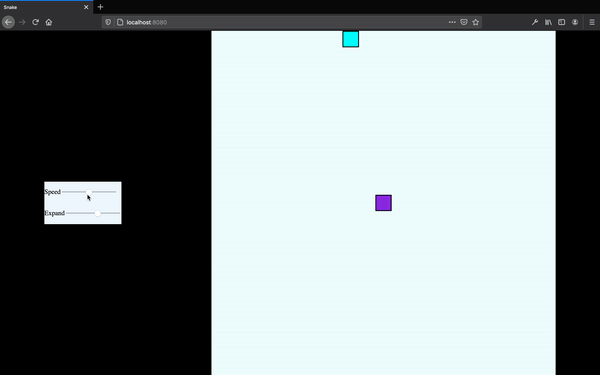

# Snake Game

## About The Project



### Built With
The basic web template for the game like game board snake and food is built using HTML/CSS. The Logic of the game like movement of snake, expansion rate of snake, speed of snake, position of food all this is devloped in VanillaJS

* [HTML/CSS]
* [VanillaJS]

## Getting Started

To get a local copy up and running follow these simple example steps.

### Prerequisites

You need to have npm installed on your system.

### Installation

1. Clone the repo

```sh
git clone https://github.com//sahil-rawat/snakegame_js.git
```

2. Install NPM packages

```sh
npm install
```

3. Run the server.

```sh
npm start
```

## Usage

You can set the speed and expansion rate according to your need and start playing using the up down left right arrows.

The speed here is the speed by which the snake will be moving.
The expansion rate defines the no. of segments to be added whenever the snake will eat the food
